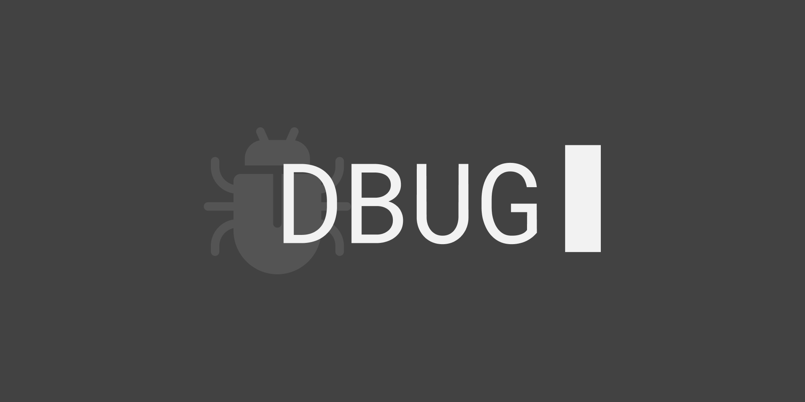
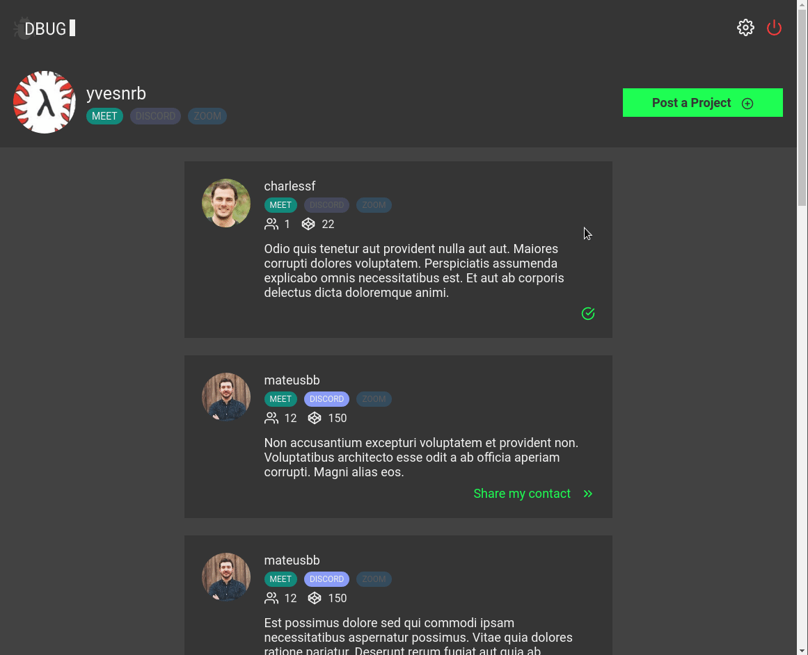
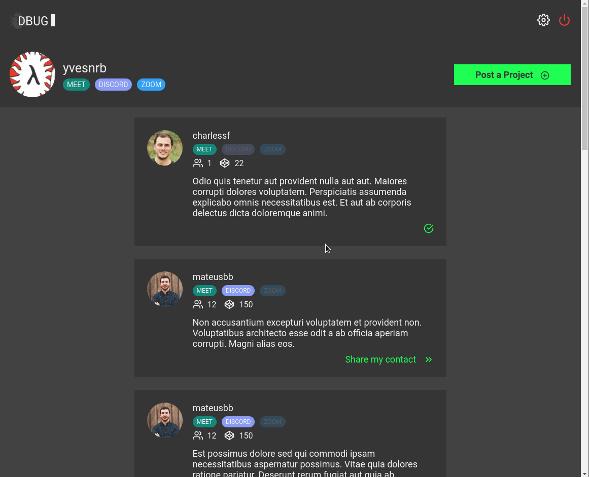
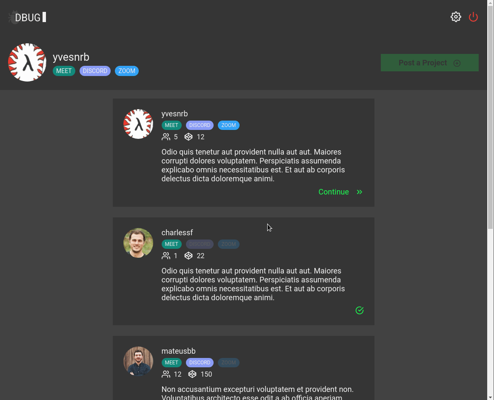
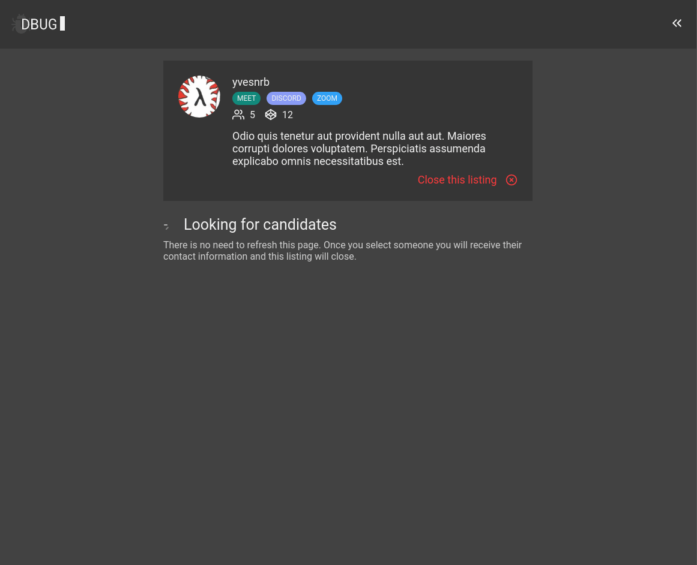

[](https://opensource.org/licenses/MIT)


<br clear="both" />

Dbug is a full stack web application that you can use to find people to pair
program using your favorite communication platforms.

## Features

### Filling in Contact Information

<br clear="both" />
It is required to have at least one of any contact information available (meet,
discord or zoom). This information is not public and only gets sent to the
author of projects you decide to share your contact with.

### Add a New Project

<br clear="both" />
You may only have one active project at once. The projects stay up indefinitely
until you either delete it or choose a contact offer.

### Share Your Contact Information

<br clear="both" />
You can do this on as many projects as you want, it does not guarantee that the
author of that project will be able to contact you as they may select some
other contact offer. Also the project list has an infinite scroll feature.

### Receive and Select Contact Offers

<br clear="both" />
New contact offers will show up on the project page. Once you select one, you
are taken to a screen were you can see all of the contact information that was
made available by that user. This will also close that project.

## Deployment

### Digital Ocean Deployment
[](https://cloud.digitalocean.com/apps/new?repo=https://github.com/yvesnrb/dbug/tree/master)
<br clear="both" />
The easiest way to get started with dbug is to use Digital Ocean's app platform,
click the above button and fill out the appropriate environment variables to get
started. This will deploy a web server, the static site and a database for you
with minimal effort.

### Application Requirements
You will need NodeJS v12.x.x, Yarn and a PostgreSQL database to run this
application.

### Environment Variables
The necessary environment variables to configure the server and web packages of
this application are listed in the README.md files of each package.
[Web README](packages/web/README.md)
<br clear="both" />
[Server README](packages/server/README.md)

### Dev Environment
After configuring the apropriate environment variables for each package use
these comands to start the application:

```
yarn
yarn workspace @dbug/server typeorm migrations:run
yarn workspace @dbug/web start
yarn workspace @dbug/server dev
```

### Building the Application
You can build this application using the following commands:
```
yarn workspace @dbug/web build
yarn workspace @dbug/server build
```
